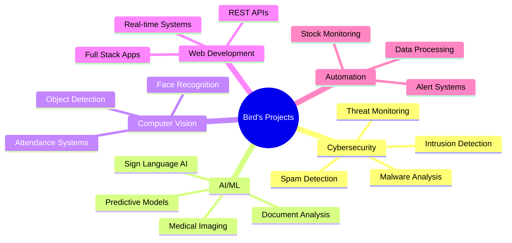

<div align="center">

# 🐦 BIRD CYBER SECURITY 🔒

[](https://git.io/typing-svg)


---

### 🦅 **BlackBird — Elite Security Researcher | Reverse Engineer | Cloud & LLM Security Specialist**


</div>

---

## 🎯 **About Me**

```python
class BirdCyberSecurity:
    def __init__(self):
        self.name = "Bird Cyber Security"
        self.role = "Cybersecurity Specialist & AI/ML Researcher"
        self.location = "Pudukkottai, Tamil Nadu, India 🇮🇳"
        self.expertise = [
            "Threat Detection & Analysis",
            "Intrusion Detection Systems",
            "AI/ML Security",
            "Face Recognition Systems",
            "Malware Analysis",
            "Web Application Security",
            "Full Stack Development"
        ]
        self.current_focus = "Building intelligent security systems"
        
    def say_hi(self):
        print("Thanks for dropping by! Let's build a secure digital future together! 🚀")

me = BirdCyberSecurity()
me.say_hi()
```

<div align="center">

[](https://github.com/ubvc04?tab=followers)
[](https://github.com/ubvc04?tab=repositories)
[](https://github.com/ubvc04)
[](https://bavesh.onrender.com/)

</div>

---

## 🚀 **Featured Projects** 

<table>
<tr>
<td width="50%">

### 🛡️ Security & Threat Detection


- 🔥 **[Intrusion Detection System](https://github.com/ubvc04/Intrusion-Detection-System)** - Hybrid HIDS/NIDS with ML-powered threat detection
- 🎯 **[Threat Detection](https://github.com/ubvc04/Threat-Detection)** - Windows 11 kernel-level security platform with AI analytics
- 🚨 **[Threat Monitor](https://github.com/ubvc04/Threat-Monitor)** - Real-time system monitoring and alerting
- 🕵️ **[IDS-Machine-Learning](https://github.com/ubvc04/IDS-Machine-Learning)** - ML-based detection for Botnets, DDoS, Malware
- 🔍 **[Spam Detection System](https://github.com/ubvc04/spam-detection-system)** - CLI tool for malicious URLs & phishing detection

</td>
<td width="50%">

### 🤖 AI/ML Applications


- 🧠 **[Brain Tumor Detection](https://github.com/ubvc04/Brain-Tumor-Detection)** - Deep learning MRI analysis with TensorFlow
- 🩺 **[SkinDisease-AI](https://github.com/ubvc04/SkinDisease-AI)** - Medical image classification with confidence scoring
- 🤟 **[SignLang-AI](https://github.com/ubvc04/SignLang-AI)** - Real-time sign language translation using CNN
- 📝 **[Document Summarizer](https://github.com/ubvc04/Document-Summarizer)** - AI-powered document analysis
- 💬 **[Word Prediction System](https://github.com/ubvc04/Word-Prediction-System)** - GPT-2 powered text prediction

</td>
</tr>
<tr>
<td width="50%">

### 👁️ Computer Vision & Recognition


- 👤 **[Multi-Face Detection System](https://github.com/ubvc04/Multi-Face-Detection-System)** - Django real-time face recognition with email alerts
- 📸 **[Smart Attendance System](https://github.com/ubvc04/Smart-Attendance-System)** - DeepFace-powered attendance tracking
- 🎓 **[Face Recognition Attendance](https://github.com/ubvc04/Face-Recognition-Attendance-System)** - Automated attendance with admin panel

</td>
<td width="50%">

### 🌐 Web Applications & Tools


- ♟️ **[Chess Game](https://github.com/ubvc04/Chess-Game)** - Real-time multiplayer with WebSockets
- 🏨 **[Hotel Reservation System](https://github.com/ubvc04/Hotel-Reservation-System)** - Complete booking platform
- 📋 **[Complaint Management System](https://github.com/ubvc04/Complaint-Management-System-)** - Chatbot & ticket support
- 🌦️ **[Weather App](https://github.com/ubvc04/Weather-App)** - Real-time weather tracking
- 💰 **[Currency Converter](https://github.com/ubvc04/currency-converter)** - Live exchange rates

</td>
</tr>
</table>

---

## 💻 **Tech Stack & Skills**

<div align="center">

### 🔥 Languages


### 🤖 AI/ML & Data Science


### 🌐 Web Technologies


### 🛡️ Cybersecurity Tools


### 🗄️ Databases


### ⚙️ DevOps & Tools


</div>

---

## 📊 **GitHub Analytics**

<div align="center">


### 🔥 **Contribution Graph**

[](https://github.com/ubvc04)

<table>
<tr>
<td width="50%">


</td>
<td width="50%">


</td>
</tr>
</table>

### 📈 **Language Distribution**


### 🏆 **GitHub Trophies**


### ⚡ **Recent Activity**

<!--START_SECTION:activity-->
<!--END_SECTION:activity-->

### 📅 **Contribution Calendar**


</div>

---

## 🎯 **Specialized Skills Matrix**

<div align="center">

| Category | Skills | Proficiency |
|----------|--------|-------------|
| 🛡️ **Security** | Threat Detection, IDS/IPS, Malware Analysis, Pentesting | ⭐⭐⭐⭐⭐ |
| 🤖 **AI/ML** | Deep Learning, CNN, Computer Vision, NLP | ⭐⭐⭐⭐⭐ |
| 🐍 **Python** | Django, Flask, TensorFlow, OpenCV, Automation | ⭐⭐⭐⭐⭐ |
| 🌐 **Web Dev** | Full Stack, React, Node.js, WebSocket, REST APIs | ⭐⭐⭐⭐ |
| 💾 **Databases** | SQL, NoSQL, Data Modeling, Optimization | ⭐⭐⭐⭐ |
| ☁️ **Cloud** | Deployment, Security, Serverless | ⭐⭐⭐ |

</div>

---

## 🏆 **Achievements & Highlights**

<div align="center">

<table>
<tr>
<td align="center" width="25%">

<br><strong>58+</strong>
<br>Repositories
</td>
<td align="center" width="25%">

<br><strong>Security</strong>
<br>Specialist
</td>
<td align="center" width="25%">

<br><strong>AI/ML</strong>
<br>Projects
</td>
<td align="center" width="25%">

<br><strong>Full Stack</strong>
<br>Developer
</td>
</tr>
</table>

### 🎖️ **Key Achievements**
- 🔐 Built multiple enterprise-grade intrusion detection systems
- 🤖 Developed AI-powered medical diagnosis applications
- 👁️ Created advanced face recognition & biometric systems
- 🌐 Deployed full-stack web applications with real-time features
- 🛡️ Specialized in threat hunting and security automation
- 📚 Active contributor to cybersecurity and ML communities

</div>

---

## 🎨 **Project Categories**

<div align="center">



</div>

---

## 📫 **Connect With Me**

<div align="center">


[](https://bavesh.onrender.com/)
[](https://github.com/ubvc04)
[](https://linkedin.com/in/ubvc04)
[](https://twitter.com/ubvc04)
[](mailto:your.email@example.com)

</div>

---

## 💡 **Current Focus**

<div align="center">

[](https://git.io/typing-svg)

</div>

---

## 📈 **Weekly Development Breakdown**

<!--START_SECTION:waka-->
<!--END_SECTION:waka-->

---

## 🐍 **Contribution Snake**

<div align="center">

<picture>
  <source media="(prefers-color-scheme: dark)" srcset="https://raw.githubusercontent.com/ubvc04/ubvc04/output/github-contribution-grid-snake-dark.svg">
  <source media="(prefers-color-scheme: light)" srcset="https://raw.githubusercontent.com/ubvc04/ubvc04/output/github-contribution-grid-snake.svg">
  
</picture>

</div>

---

## 💭 **Random Dev Quote**

<div align="center">


</div>

---

## 🎯 **Code Philosophy**

<div align="center">

```python
while True:
    learn()
    code()
    secure()
    innovate()
    share_knowledge()
    repeat()
```

### 🔐 "Security is not a product, but a process. Let's build it together."


</div>

---

<div align="center">

### ⭐ **Star my repositories if you find them useful!**
### 🤝 **Open to collaborations and security research opportunities**


**Thanks for visiting! Let's make the digital world safer together! 🚀🔒**


</div>

---

<div align="center">


</div>
