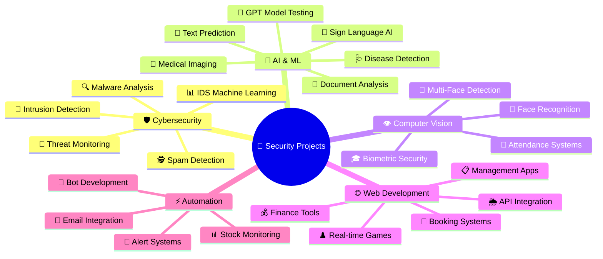

<div align="center">

# 🔐 CYBER SENTINEL 🛡️

[](https://git.io/typing-svg)


---

### 🦅 **BlackBird — Security Architect | Reverse Engineer | Cloud & LLM Security Expert**


</div>

---


<div align="center">

[](https://github.com/ubvc04?tab=followers)
[](https://github.com/ubvc04?tab=repositories)
[](https://github.com/ubvc04)
[](https://bavesh.onrender.com/)

</div>

---

## 🚀 **Featured Security Projects** 

<table>
<tr>
<td width="50%">

### 🛡️ **Threat Detection & Security Systems**


- 🔥 **[IDS Machine Learning](https://github.com/ubvc04/IDS-Machine-Learning)** - ML-based detection: Botnets, DDoS, DoS, Malware, Phishing
- 🎯 **[Intrusion Detection System](https://github.com/ubvc04/Intrusion-Detection-System)** - Hybrid HIDS/NIDS with real-time threat alerts
- 🚨 **[Threat Detection](https://github.com/ubvc04/Threat-Detection)** - Windows 11 kernel-level monitoring with AI analytics
- 🕵️ **[Threat Monitor](https://github.com/ubvc04/Threat-Monitor)** - Real-time system security monitoring (C#)
- 🔍 **[Spam Detection System](https://github.com/ubvc04/spam-detection-system)** - ML-powered malicious URL & phishing detector

</td>
<td width="50%">

### 🤖 **AI/ML Security Applications**


- 🧠 **[Brain Tumor Detection](https://github.com/ubvc04/Brain-Tumor-Detection)** - TensorFlow deep learning for MRI analysis
- 🩺 **[SkinDisease-AI](https://github.com/ubvc04/SkinDisease-AI)** - Medical imaging classification system
- 🤟 **[SignLang-AI](https://github.com/ubvc04/SignLang-AI)** - Real-time sign language translation with CNN
- 📝 **[Document Summarizer](https://github.com/ubvc04/Document-Summarizer)** - AI-powered NLP document analysis
- 💬 **[Word Prediction System](https://github.com/ubvc04/Word-Prediction-System)** - GPT-2 based text prediction engine
- 🧪 **[GPT Model Test Files](https://github.com/ubvc04/GPT_Model_Test_Files)** - Adversarial testing suite for LLMs

</td>
</tr>
<tr>
<td width="50%">

### 👁️ **Computer Vision & Biometric Security**


- 👤 **[Multi-Face Detection System](https://github.com/ubvc04/Multi-Face-Detection-System)** - Django real-time face recognition with email alerts
- 📸 **[Smart Attendance System](https://github.com/ubvc04/Smart-Attendance-System)** - DeepFace biometric attendance tracking
- 🎓 **[Face Recognition Attendance](https://github.com/ubvc04/Face-Recognition-Attendance-System)** - Automated attendance with admin dashboard

</td>
<td width="50%">

### 🌐 **Full Stack Web Applications**


- ♟️ **[Chess Game](https://github.com/ubvc04/Chess-Game)** - Real-time multiplayer with WebSocket (TypeScript)
- 🏨 **[Hotel Reservation System](https://github.com/ubvc04/Hotel-Reservation-System)** - Complete booking platform (Java)
- 📋 **[Complaint Management System](https://github.com/ubvc04/Complaint-Management-System-)** - Chatbot integration & ticket support
- 📊 **[Yes Bank Bot](https://github.com/ubvc04/Yes-Bank-Bot)** - Stock price monitoring & email alerts
- 🌦️ **[Weather App](https://github.com/ubvc04/Weather-App)** - Real-time weather tracking API
- 💰 **[Currency Converter](https://github.com/ubvc04/currency-converter)** - Live exchange rates converter

</td>
</tr>
<tr>
<td colspan="2">

### 🎮 **Game Development & Interactive Apps**
<div align="center">


🐍 **[Snake Game](https://github.com/ubvc04/Snake-Game)** • ⭕ **[Tic-Tac-Toe](https://github.com/ubvc04/Tic-Tac-Toe)** • 📝 **[Quiz Application](https://github.com/ubvc04/Quiz-Application)** • ✅ **[To-Do App](https://github.com/ubvc04/To-Do-App)** • 🧮 **[Calculator](https://github.com/ubvc04/calc)** • ⏱️ **[Stopwatch](https://github.com/ubvc04/stopwatch-web-app)** • 🕐 **[Analog Clock](https://github.com/ubvc04/Analog_Clock)**

</div>
</td>
</tr>
</table>

---

## 💻 **Tech Arsenal & Skills**

<div align="center">

### 🔥 **Languages**


### 🤖 **AI/ML & Data Science**


### 🌐 **Web Technologies & Frameworks**


### 🛡️ **Cybersecurity Arsenal**


### 🗄️ **Databases**


### ⚙️ **DevOps & Tools**


</div>

---

## 📊 **GitHub Analytics & Statistics**

<div align="center">


### 🔥 **Contribution Graph**

[](https://github.com/ubvc04)

<table>
<tr>
<td width="50%">


</td>
<td width="50%">


</td>
</tr>
</table>

### 📈 **Most Used Languages**


### 🏆 **GitHub Trophies**


### 📅 **Contribution Heatmap**


</div>

---

## 🎯 **Specialized Skills Matrix**

<div align="center">


| 🎯 Domain | 🛠️ Technologies & Skills | 💪 Proficiency |
|-----------|-------------------------|----------------|
| 🛡️ **Cybersecurity** | Threat Detection, IDS/IPS, SIEM, Malware Analysis, Pentesting, OWASP Top 10 | ⭐⭐⭐⭐⭐ |
| 🔒 **Network Security** | Firewall Configuration, VPN, Wireshark, Snort, Packet Analysis | ⭐⭐⭐⭐⭐ |
| 🤖 **AI/ML Security** | Deep Learning, CNN, Computer Vision, NLP, Adversarial ML, Model Security | ⭐⭐⭐⭐⭐ |
| 🐍 **Python Development** | Django, Flask, TensorFlow, Keras, OpenCV, Automation, Scripting | ⭐⭐⭐⭐⭐ |
| 🌐 **Web Development** | Full Stack (MERN), React, Node.js, WebSocket, REST APIs | ⭐⭐⭐⭐ |
| 💾 **Database Systems** | SQL, NoSQL, Database Design, Query Optimization, Data Security | ⭐⭐⭐⭐ |
| 🐧 **Linux Administration** | Kali Linux, Ubuntu, System Hardening, Bash Scripting | ⭐⭐⭐⭐ |
| ☁️ **Cloud Security** | Cloud Architecture, AWS, Security Best Practices | ⭐⭐⭐ |

</div>

---

## 🏆 **Achievements & Highlights**

<div align="center">


<table>
<tr>
<td align="center" width="25%">

<br><strong>58+</strong>
<br><sub>Public Repositories</sub>
</td>
<td align="center" width="25%">

<br><strong>Security</strong>
<br><sub>Specialist</sub>
</td>
<td align="center" width="25%">

<br><strong>AI/ML</strong>
<br><sub>Projects</sub>
</td>
<td align="center" width="25%">

<br><strong>Full Stack</strong>
<br><sub>Developer</sub>
</td>
</tr>
</table>

### 🎖️ **Core Competencies**

✅ Built **enterprise-grade intrusion detection systems** with ML-powered threat analytics  
✅ Developed **AI medical diagnosis applications** using TensorFlow & deep learning  
✅ Created **advanced biometric authentication systems** with face recognition  
✅ Deployed **real-time security monitoring** solutions with instant alerting  
✅ Implemented **full-stack web applications** with secure architecture  
✅ Specialized in **threat hunting, malware analysis** and security automation  
✅ Active contributor to **cybersecurity & open-source** communities  

</div>

---

## 🎨 **Project Ecosystem Map**

<div align="center">




</div>

---

## 📫 **Connect & Collaborate**

<div align="center">


[](https://bavesh.onrender.com/)
[](https://github.com/ubvc04)
[](https://linkedin.com/in/ubvc04)
[](https://twitter.com/ubvc04)
[](mailto:bavesh@example.com)
[](https://discord.com)

</div>

---

## 💡 **Current Mission**

<div align="center">


[](https://git.io/typing-svg)

</div>

---

## 🐍 **Contribution Snake Animation**

<div align="center">

<picture>
  <source media="(prefers-color-scheme: dark)" srcset="https://raw.githubusercontent.com/ubvc04/ubvc04/output/github-contribution-grid-snake-dark.svg">
  <source media="(prefers-color-scheme: light)" srcset="https://raw.githubusercontent.com/ubvc04/ubvc04/output/github-contribution-grid-snake.svg">
  
</picture>

</div>

---

## 💭 **Security Quote of the Day**

<div align="center">


</div>

---

## 🎯 **Hacker Mindset**

<div align="center">

```python
class HackerMindset:
    def __init__(self):
        self.principles = {
            "learn": "Never stop learning",
            "share": "Knowledge grows when shared",
            "secure": "Think like an attacker, defend like a pro",
            "automate": "Automate repetitive tasks",
            "innovate": "Push boundaries of what's possible"
        }
    
    def life_loop(self):
        while True:
            self.learn()
            self.hack()
            self.secure()
            self.share()
            self.sleep(4)  # Sleep is optional 😉

hacker = HackerMindset()
hacker.life_loop()
```


</div>

---

## 📊 **Weekly Development Breakdown**

<!--START_SECTION:waka-->
<!--END_SECTION:waka-->

---

<div align="center">

### ⭐ **Star my repositories if you find them useful!**
### 🤝 **Open to collaborations, bug bounty, and security research**
### 🔐 **Let's build a safer digital world together!**


<img src="https://user-images.githubusercontent.com/74038190/212284115-f47e
